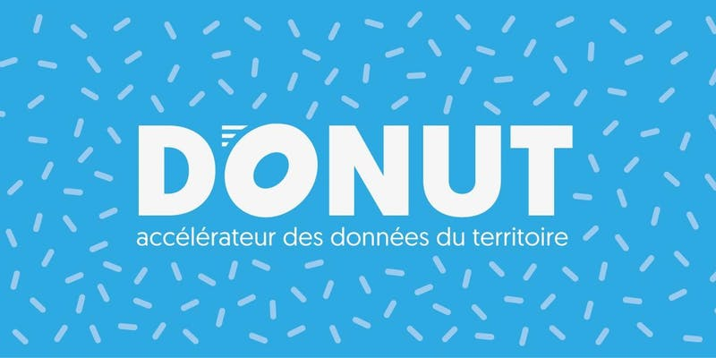

layout: true
  
`r paste0("
", params$event, " 

")` 

---

class: center, middle

Retrouvez les matériaux sur https://github.com/datactivist/datamythes/

Ces slides en ligne : http://datactivist.coop/datamythes/

Les contenus créés par Datactivist sont placés sous [licence Creative Commons CC-BY-SA](https://creativecommons.org/licenses/by-sa/3.0/deed.fr). 

---

.reduite[]

### Un atelier dans le cadre de DONUT

---

## Objectifs de l'atelier

.pull-left[
* Casser (ou valider) des mythes sur le vélo à Marseille

* Découvrir une méthode générique pour trouver et utiliser des données ouvertes

* Pointer les limites des données disponibles par rapport aux  questions exprimées par les participant-e-s
]

.pull-right[
.reduite[]
]

---

## Déroulé de l'atelier

.pull-left[
.reduite[]
]
.pull-right[
Nous allons suivre la méthodologie de la [Data Pipeline](http://schoolofdata.org/methodology) développée par School of Data 

* Une méthodologie générique pour la découverte et l'usage de données ouvertes

* 7 étapes qui, selon les projets, prennent une importance plus ou moins grande. 

* La pipeline sera la trame de cet atelier. 
]
---
class:middle, center
#  Au fait, c'est quoi une donnée ouverte ?

### Une donnée ouverte est une donnée qui peut être librement utilisée, réutilisée et redistribuée par quiconque.

.footer[[Open Definition](http://opendefinition.org/)]

---

# Quel est votre profil ?

.pull-left[
.reduite[]
]

.pull-right.middle[
* #### Narrateur ou narratrice ?

* #### Explorateur ou exploratrice ?

* #### Technicien-ne de données ?

* #### Analyste ?

* #### Designer ?

]

---

## Définir

.pull-left[
.reduite[]
]
.pull-right[

- ### Définir précisément votre problème (que souhaitez vous résoudre ?)

- ### Identifier les données utiles

]

---
## Trouver

.pull-left[
.reduite[]
]
.pull-right[

- ### Moteur de recherche

- ### Portails open data

- ### Producteurs de données

- ### OpenStreetMap ?

]

---
## Récupérer 